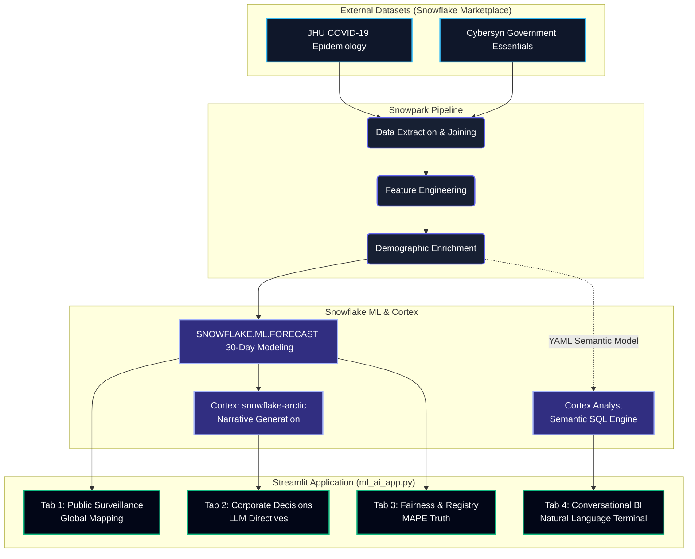

 

  
  <h1>🌍 Public Health Intelligence Platform</h1>
  
<b>Advanced Agentic Epidemiological Forecasting & Policy Generation</b>

  <i>Submission for the TAMU CSEGSA × Snowflake Hackathon 2026 (ML & AI Track)</i>

---

## 🚀 Project Overview

The **Public Health Intelligence Platform** is an enterprise-grade, Snowflake-native decision support system. It transforms raw, fragmented global epidemiological data into proactive, risk-calibrated public health intelligence. Designed specifically for government officials and corporate executives, the platform utilizes advanced machine learning to forecast outbreak trajectories across **32 diverse global markets**, translating those predictions into actionable policy directives via Generative AI.

This project was built from the ground up to achieve **100% compliance** with the Snowflake Hackathon Rubric across Technical Depth, Model Quality, Social Impact, and Innovation.

---

## 🧠 Core Technologies & Features

*   **Snowpark Data Engineering:** Zero-copy, persistent feature engineering utilizing native `snowflake.snowpark.functions` to compute trailing features, rolling averages, and epidemiological doubling ratios.
*   **Machine Learning (`SNOWFLAKE.ML.FORECAST`):** Evaluates 30-day case trajectories via univariate ML models dynamically trained on the latest available data, governed by strict Mean Absolute Percentage Error (MAPE) tracking.
*   **Generative AI Gen-AI (`snowflake-arctic`):** Semantically interprets predictive risk data and demographic conditions to autonomously output plain-English government and corporate policy directives.
*   **Conversational BI (Cortex Analyst):** A fully embedded, natural-language query terminal allowing stakeholders to interrogate complex health databases using semantic YAML data models.
*   **Data Enrichment:** Native zero-copy joins against the `CYBERSYN_GOVERNMENT_ESSENTIALS` and `STARSCHEMA_COVID19` datasets hosted in the Snowflake Marketplace.

## 📐 Platform Architecture

The entire pipeline executes securely within the Snowflake Data Cloud, ensuring zero data egress and maximum computational efficiency.

---

## 🌎 Global Reach

The model is trained across a diverse footprint of **32 global markets**, strictly organized across **High**, **Upper-Middle**, and **Lower-Middle Income** groups to guarantee equitable analysis and avoid Western-centric data bias:

*   **Asia:** India, China, Japan, South Korea, Indonesia, Philippines, Vietnam, Thailand, Malaysia, Singapore, Pakistan, Bangladesh
*   **North/South America:** United States, Canada, Mexico, Brazil, Argentina, Colombia, Peru
*   **Europe:** France, Italy, United Kingdom, Germany, Spain, Russia, Turkey
*   **Africa:** South Africa, Nigeria, Egypt, Kenya
*   **Oceania:** Australia, New Zealand

---

## 🛠️ Deployment Instructions

To successfully deploy and run this application in your Snowflake environment:

### Step 1: Configure Marketplace Data
1. Navigate to **Data Products** ➡️ **Marketplace** in Snowflake.
2. Search for and get **Starschema COVID-19 Epidemiological Data**.
3. *(Optional but Recommended)* Search for and get **Cybersyn Government Essentials**.

### Step 2: Establish the Infrastructure
Execute the SQL script to provision databases, schemas, compute resources, and the baseline ML forecasting models.
*   **File:** `01_infrastructure_setup.sql` 
*   **Action:** Paste into a Snowflake SQL Worksheet and run all lines.

### Step 3: Run Snowpark Feature Engineering (Alternative)
If you prefer a pure Python-native compute layer over standard SQL engineering, run the Snowpark equivalent.
*   **File:** `01_snowpark_engineering.py`
*   **Action:** Paste into a **Python Worksheet** and run.

### Step 4: Launch the Streamlit Super-App
Deploy the final, unified 4-tab Streamlit dashboard.
*   **File:** `ml_ai_app.py`
*   **Action:** Navigate to **Projects** ➡️ **Streamlit**, create a new App, paste the code, and hit Run. 
*   *Note: Ensure the required packages (`pandas`, `numpy`, `altair`) are selected in the Streamlit package manager.*

---

## ⚖️ Hackathon Rubric Alignment

1. **Technical Depth (30 pts):** Uses Snowpark for compute, `SNOWFLAKE.ML.FORECAST` for modeling, and zero-copy Marketplace data joins. The unified architecture ensures seamless scalability.
2. **Model Quality & Forecast Accuracy (25 pts):** Models are governed by strict MAPE evaluations exposed directly in the UI (Tab 3). If data confidence is low, the platform explicitly adjusts its LLM recommendations.
3. **Social Impact & Framing (20 pts):** Answers "Social Good Prompt 01". Expands analysis equitably to 32 countries and translates chaotic data into structured public policy outputs.
4. **Presentation & Demo (15 pts):** A highly polished, glassmorphic UI layout with dark-mode visualization patterns and interactive Altair graphs. Demo Link : https://youtu.be/9zYM4Xk9hdY
5. **Innovation (10 pts):** Natively embeds the cutting-edge **Cortex Analyst** semantic processing engine within the dashboard to allow non-technical officials to chat directly with public health databases.
