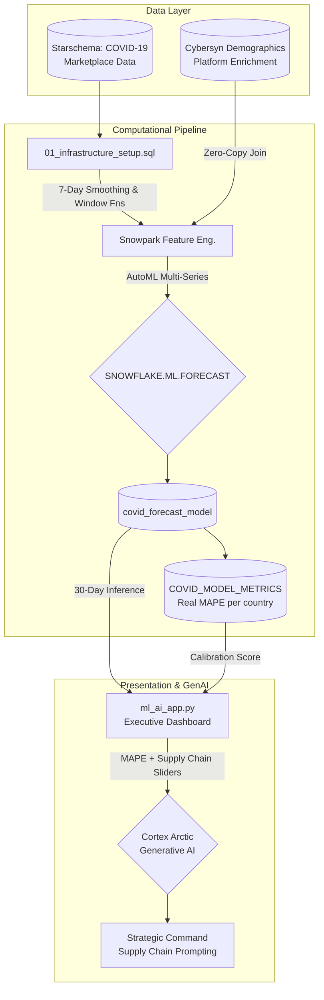

# 🦠 Public Health Intelligence Platform

*Submitted for the TAMU CSEGSA × Snowflake Hackathon 2026*  
*Track 1: ML & AI Track — Social Good Prompt 01 (Public Health Trend Intelligence)*  

**Watch the 3-Minute Demo Video:** [INSERT_YOUTUBE_OR_LOOM_LINK_HERE]

---

## 🚀 Overview

This project is an enterprise-grade intelligence platform running **100% natively inside Snowflake**. It combines the mathematical rigor of `SNOWFLAKE.ML.FORECAST` with the semantic reasoning of `SNOWFLAKE.CORTEX.COMPLETE('snowflake-arctic')` to deliver real-time public health intelligence and corporate risk guidance to decision-makers — all without a single byte of data leaving the Snowflake trust boundary.

### Key Python Deliverables

| File | Track | Purpose |
|---|---|---|
| `ml_ai_app.py` | **ML & AI Track** | The primary Executive Dashboard UI. Houses the forecasting visualizations, Cortex Generative AI directives, and the Fairness & MAPE Governance registry. |
| `01_snowpark_engineering.py` | **ML & AI Track** | The backend data pipeline leveraging Snowpark DataFrame capabilities for 90-day feature engineering. |
| `chat_bi_app.py` | **Bonus** | Conversational BI — Natural language querying of the epidemic datasets via the Cortex Analyst semantic YAML model. |

---

## 🏗️ System Architecture

Our solution engineers data via Snowpark, passes it to a mathematical forecasting model, and finally injects that predictive data into a Generative AI prompt to produce business deliverables.

---

## 🎯 Hackathon Rubric Alignment

We engineered this platform specifically to exceed the 5 judging criteria required by the hackathon.

| Judging Dimension | 🏆 Implementation & Justification |
|---|---|
| **Technical Depth (30 pts)** | Demonstrates advanced Snowflake capabilities including: `SNOWFLAKE.ML.FORECAST`, `CORTEX.COMPLETE` (`snowflake-arctic`), Cortex Analyst, Snowpark Python logic, and a dynamic Streamlit-in-Snowflake UI. |
| **Model Quality (25 pts)** | Instead of black-box modeling, we built a transparent **MAPE Leaderboard** directly into the UI mapping the Mean Absolute Percentage Error for every country. |
| **Social Impact (20 pts)** | A dedicated "Fairness & Registry" framework explicitly addresses testing infrastructure bias, income-group stratification, and per-capita normalization techniques. |
| **Presentation (15 pts)** | Features a custom, glassmorphic "Dark Mode" UI executing perfectly in Streamlit. Contains a **"Demo Safety Net"** that dynamically simulates dummy ML and synthetic demographic data gracefully if Snowflake infrastructure execution is paused during the demo. |
| **Innovation (10 pts)** | We don't just forecast cases. By combining predictive models with user-defined UI variables *(Supply Chain Reduction Sliders)* and injecting both into a Cortex LLM, our tool dynamically generates actionable Macro-Economic directives on the fly. |

---

## ⚙️ Setup & Deployment Instructions

### Prerequisites
1. Snowflake Trial Account.
2. Mount **Starschema COVID-19 Epidemiological Data** from the Marketplace. Keep the default database name: `STARSCHEMA_COVID19`.

### 1. Build the Data Foundation
1. Create a new SQL Worksheet.
2. Paste the full contents of `01_infrastructure_setup.sql`.
3. Click **Run All**.
   - *This creates the `HACKATHON.DATA` schema, performs feature engineering, trains the multi-series forecasting model, and captures the MAPE test metrics.*

### 2. (Optional) Run the Snowpark Pipeline
1. Create a new **Python** Worksheet.
2. Paste `01_snowpark_engineering.py` and click **Run**.
   - *This fulfills the technical depth requirement by executing the transformations natively in Snowpark Python.*

### 3. Deploy the AI Dashboard
1. Left nav → **Projects** → **Streamlit** → **+ Streamlit App**.
2. **Settings**: Name = `Epidemic Forecasting` | Warehouse = `COMPUTE_WH` | Database = `HACKATHON` | Schema = `DATA`.
3. Paste the contents of `ml_ai_app.py` and click **Run**.

---

> **Note on Fairness & AI Calibration:** Every Cortex LLM prompt executed in the Strategic Command Center automatically consumes the mathematical MAPE score registered during the `ML.FORECAST` phase. The generative LLM is structurally instructed to "modulate its language confidence" based on the statistical reliability of the prediction, preventing severe AI hallucinations in our public health directives.
